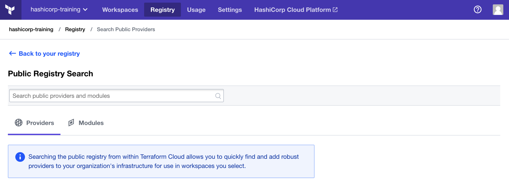

[vcs]: ../vcs/index.html

# Adding Public Providers and Modules to the Private Registry

> **Hands-on:** Try the [Add Public Modules to your Private Registry](https://learn.hashicorp.com/tutorials/terraform/module-private-registry-add?in=terraform/modules&utm_source=WEBSITE&utm_medium=WEB_IO&utm_offer=ARTICLE_PAGE&utm_content=DOCS) tutorial on HashiCorp Learn.

You can add both providers and modules from the public [Terraform Registry](/docs/registry/index.html) to your Terraform Cloud private registry. Once added, Terraform Cloud automatically synchronizes public providers and modules with their source on the Terraform Registry. The private registry handles downloads and controls access with Terraform Cloud API tokens, so consumers don't need access to the provider and module source repositories, even when they run Terraform from the command line.

All members of an organization can view and use public providers and modules, but you need [owners team](/docs/cloud/users-teams-organizations/permissions.html#organization-owners) permissions to add them to the private registry. Owners can add providers and modules through the UI as shown below or through the [Registry Modules API](../api/modules.html#create-a-module-with-no-vcs-connection-).

-> **Note:** Public modules are not supported in Terraform Enterprise.
[permissions-citation]: #intentionally-unused---keep-for-maintainers

## Adding a Public Module

1. Click **Registry** in the main navigation bar to go to your organization's private registry and then click **Search public registry**.

   

   The **Public Registry Search** page appears.

   

2. Enter any combination of namespaces (e.g. hashicorp) and module/provider names into the search field. You can click **Providers** and **Modules** to toggle between lists of providers and modules that meet the search criteria.

3. Do one of the following to add a provider or module to your private registry:
    - Hover over the provider or module and click **+ Add**.
     
    - Click the provider or module to view its details and then click **Add to Terraform Cloud**.
     

4. Click **Add to organization** in the dialog box. The provider or module is now included in the private registry, and members of your organization can begin using it.

## Deleting a Public Provider or Module

Deleting a public provider or module from a private registry does not remove it from the Terraform Registry. To delete a public provider or module from your organization's module registry:

1. Click **Registry** in the main navigation bar to go to your organization's private registry.

2.  Select the provider or module to view its details, open the "Manage Module for Organization" dropdown menu, and click "Delete module".
   

2. Enter the provider or module name in the dialog box to confirm and then click "Delete."
